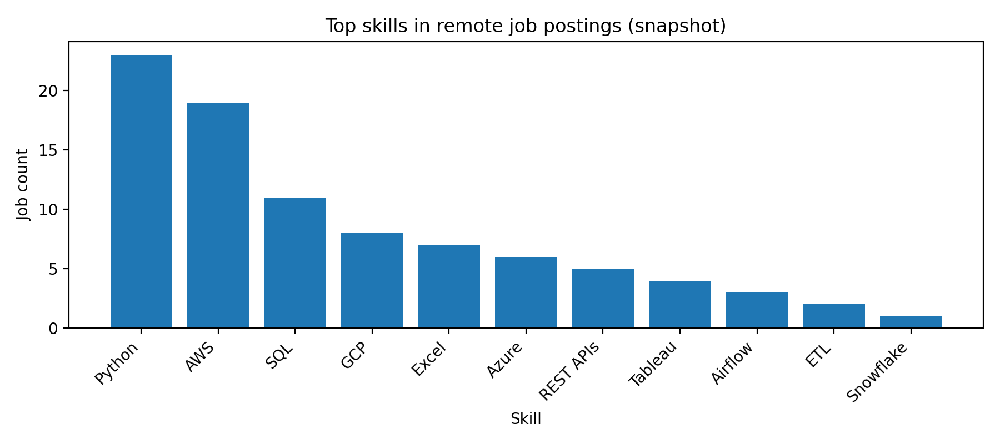

# job-skills-mini

Mini project: which skills appear most often in a small snapshot of remote tech job postings?

## Quick look


## What’s here
- **data/remoteok_2025-08-29.json** — raw snapshot I collected (one day).
- **sql/schema.sql** — SQLite tables (`job`, `skill`, `job_skill`).
- **01_load_json.py** — loads the JSON into SQLite (`data/jobs.sqlite`).
- **02_tag_skills.py** — tags skills in job text (simple regex list).
- **03_analyze.py** — counts skills → `data/top_skills.csv`.
- **04_visualize.py** — plots the CSV → `figs/top_skills.png`.

## How to reproduce

### Quick start (Windows / macOS / Linux)
Install the only dependency and run the four scripts in order:

```bash
pip install -r requirements.txt
python 01_load_json.py
python 02_tag_skills.py
python 03_analyze.py
python 04_visualize.py
